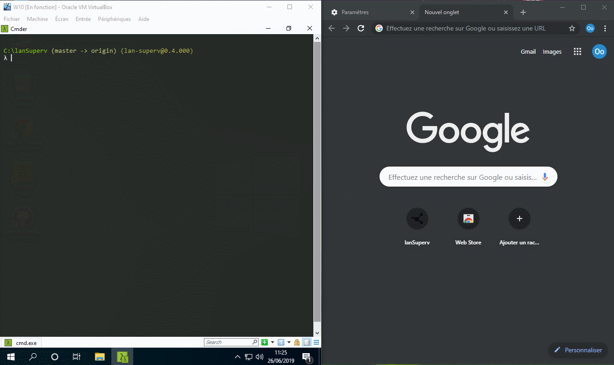

# lanSuperv
## nodejs lan supervision



### How to install ?
1) Run executable, by example in windows console : "lan-superv.exe --config=D:\SRV_WEB\lanSuperv\config.js"
note : if no --config is specified, it's looks for a "config.js" file in the executable directory
2) Go to http://localhost:842

### How to dev ?
1) Download and install last stable version of node js for windows : 
<br /> https://nodejs.org/en/download
2) Download the application zip and extract it
3) Setup node-gyp requirements (if needed for native modules)
> Node.js 24 LTS is required
> For native modules compilation, install Visual Studio Build Tools or Visual Studio Community
```sh
$ npm config set msvs_version 2015 --global
$ npm install -g node-gyp-install
$ npm install -g node-gyp #(node-gyp have to be installed globaly)
```
4) Install dependencies with the command: "npm install" 
5) Build assets with the command: "npm run dev" (no minified javascript for debug purposes)
6) Copy "config.js.sample" to "config.js" and edit the file
7) Launch application with the command: "npm start"

### On the target machine(s), how to enable WOL and PING ?
#### WOL :
You have to validate all theses things :
In the bios, option nammed "WOL" or "WakeOnLan" or "PCI-E Wake" is enabled
In the OS, properties of the ethernet card, power management : 
   UNCHECK  allow the computer to turn off this device to save energy. 
   CHECK    allow this device to wake the computer from sleep mode.
   CHECK    only allow a magic packet to wake the computer from sleep mode
(On french windows : Panneau de configuration\Réseau et Internet\Connexions réseau, clic droit sur connexion Ethernet, Proprietes, Configurer..., Gestion de l'alimentation)
#### PING : 
By default computer responds to PING but not on windows 11, even in a private network, you might have to allow it explicitly in the firewall with theses command for ipv4 and ipv6 :
netsh advfirewall firewall add rule name="ICMP Allow incoming V4 echo request" protocol=icmpv4:8,any dir=in action=allow
netsh advfirewall firewall add rule name="ICMPv6 Allow" protocol=icmpv6:8,any dir=in action=allow